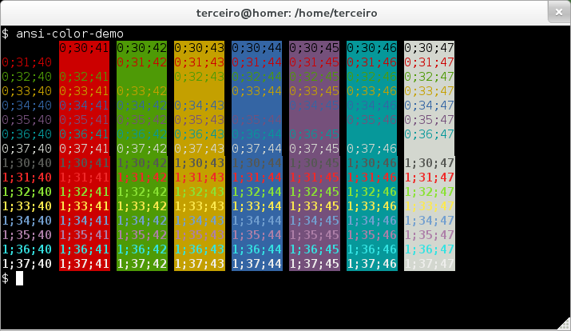

# Notes

## What does it stand for

SH - Bourne shell, by Stephen Bourne at Bell Labs

BASH - Bourne again shell (born again shell)

PERL - Practical Extraction and Report Language

POSIX usually follows existing implementation, it rarely specifies new behavior. There are multiple shells around; for the most part, POSIX follows the Korn shell but omits most features that are not present in the Bourne shell (**as the Bourne shell is largely abandoned**, the next version of POSIX is likely to include new ksh features though).

## Expansion in POSIX

- First step, beginning to end
  - Tilde expansion --> ~
  - Parameter expansion --> ?
  - command substitution --> ?
  - Arithmetic expansion --> ?
- Second step - Field splitting (unless IFS is null) --> ?
- Thrid step - Pathname expansion (unless set -f is in effect) --> ?
- Fourth step - Quote removal

## Expansion in BASH (<https://tldp.org/LDP/Bash-Beginners-Guide/html/sect_03_04.html)>

After the command has been split into tokens (see Section 1.4.1.1), these tokens or words are expanded or resolved. There are eight kinds of expansion performed, in the order that they are expanded.

After all expansions, quote removal is performed.

The "$" character introduces **parameter expansion**, **command substitution**, or **arithmetic expansion**.

*1.Brace 2.Tilde 3.Param&Var 4.Command 5.Arithmetic 6.Process 7.Word 8.Filename*

1. Brace expansion
   1. echo brace yourself {1..2}sp{el,il,al}l
   2. Gets expanded in place
   3. echo \"aa{1,2,3,4,5}ee\"
   4. mkdir projekt/{old ,new,dist,bugs}
2. Tilde expansion
   1. export PATH="$PATH:~/testdir"
3. Shell parameter and variable expansion
   1. $PARAMETER
   2. ${PARAMETER}
   3. echo ${FRANKY:=Franky}
   4. echo ${!N*}
   5. echo ${variable:-word}  # DON'T initialize variable
   6. echo ${variable:=word}  # initialize variable

```bash
$ export xyzzy=plugh ; export plugh=cave

$ echo ${xyzzy}  # normal, xyzzy to plugh
plugh

$ echo ${!xyzzy} # indirection, xyzzy to plugh to cave
cave
```

4. Command substitution
   1. $(command) aka \`command\`
5. Arithmetic expansion
   1. $(( EXPRESSION ))
   2. $[ EXPRESSION ]
   3. echo $((2 * $((3+4)) + $((12-3))))
   4. echo $[2 * $[3+4] + $[12-3]]
6. Process substitution
   1. TODO though we don't really cover this
7. Word splitting
   1. a='b c'
   2. mkdir $a  # creates two directories
   3. mkdir "$a"  # creates only one directory
   4. a="ls -l"
   5. $a  # same as running ls -l
8. File name expansion
   1. The symbols:
      1. \* -- \*.txt -- anything, can also be empty
      2. \? -- a?c -- any symbol, but only one
      3. \[ -- [abc] aka [a-c] -- a or b or c
   2. Abcd...
   3. [^\(] aka [!\(]
   4. [abc[]
   5. [-abc] aka [abc-]
   6. POSIX -- [:class:]
      1. [:alnum:]
      2. [:alpha:]
      3. [:ascii:]
      4. [:blank:]
      5. [:digit:]
      6. [:lower:]
      7. [:upper:]
      8. [:space:]
      9. [:cntrl:]
      10. [:graph:]
      11. [:print:]
      12. [:punct:]
      13. [:xdigit:]
      14. [:word:]
      15. ls [[:alpha:]]*[[:digit:]]*

```bash
#!/usr/bin/env bash
# -*- coding: utf-8 -*-utf-8 -*-

echo aee
echo $BASH_ENV
echo aee

for item in {a,b,c}; do
    echo "$item"
done

month=("Jan" "Feb" "Mar" "Apr" "May" "Jun" "Jul" "Aug" "Sep" "Oct" "Nov" "Dec")
echo ${month[3]}

letter_combos=({a..z}{a..z})
echo ${letter_combos[0]}
echo ${letter_combos[1]}
echo ${letter_combos[200]}

dec2bin=({0..1}{0..1}{0..1}{0..1}{0..1}{0..1}{0..1}{0..1})
echo ${dec2bin[25]}

a="Too longgg"
echo ${a%gg}
echo ${a%xg}

# tldr convert
convert image.jpg image.png

i=image.jpg
convert $i ${i%jpg}png
for i in *.jpg; do convert $i ${i%jpg}png; done

a="Hello World!"
echo Goodbye${a#Hello}, gonna go sleep

echo "I found all these PNGs:"; find . -iname "*.png"; echo "Within this bunch of files:"; ls > PNGs.txt
vs
{ echo "I found all these PNGs:"; find . -iname "*.png"; echo "Within this bunch of files:"; ls; } > PNGs.txt
```

```bash
case 0 in
  0)  echo nula
      echo 0;;
  1)  echo jedan
      echo 1;;
esac

case 0 in    0  ) echo nula; echo 0;; 1) echo jedan; echo 1;; esac

char="-"
case "$char" in
  [0-9] ) echo "znamenka";;
  [a-z] ) echo "malo slovo";;
  [A-Z] ) echo "veliko slovo";;
    ?   ) echo "specijalni znak";;
    *   ) echo "molim upisite jedan znak";;
esac

for b in {0,1}{0,1}{0,1}{0,1}; do echo $b; done
for f in *.*; do echo $f; done
for arg in $@; do echo $arg; done
for arg; do echo $arg; done

i=1
until [[ "$i" -gt 5 ]]
do
  echo $i
  i=$(($i + 1))
done

i=1; until [[ "$i" -gt 5 ]]; do echo $i; i=$(($i + 1)); done

i=0
while [[ 1 -eq 1 ]]; do
  while [[ 1 -eq 1 ]]; do
    while [[ 1 -eq 1 ]]; do
      i=$(($i+1))
      echo $i
      if [[ "$i" -eq 10 ]]; then
        echo "break 0 is out of range.. won't do that"
        # break 0
      elif [[ "$i" -eq 11 ]]; then
        echo "break 1"
        break 1
      elif [[ "$i" -eq 12 ]]; then
        echo "break 2"
        break 2
      elif [[ "$i" -eq 13 ]]; then
        echo "break 3"
        break 3
      fi
      echo c
    done

    echo b

  done
  echo a
done

echo "a b c d e f g h" | sed -r "s/([^ ] )/\1\n/g"
x=$(echo "a b c d e f g h" | sed -r "s/([^ ] )/\1\n/g")
echo $x
echo -e $x

echo "" > outputs.txt
for f in *.md; do
  i=1
  while read line; do
    echo $i
    i=$(($i+1))
  done < "$f" >> outputs.txt
  echo "" >> outputs.txt
done
```

## Some basic linux system commands

```bash
uname -a # uname for unix name
uname -v

date
date --utc
uptime
last reboot

hostname # aka uname -n
hostname -i # show all network addresses

who # is logged in
```

Kernel version information **uname -r** or **cat /proc/version**:

- **5.4.27-1-MANJARO**
  - 5 -- kernel version
  - 4 -- major revision
  - 27 -- minor revision
  - 1 -- patch number
  - MANJARO -- distribution specific information

## He wanted some lederhosen

```bash
brain="brian"
echo "${brain}"
echo "${brain%n}"
echo "${brain#b}"
echo "${brain^}"
echo "${brain^^}"
echo "${brain,}"
echo "${brain,,}"

gifts=(sweater gameboy wagon pillows chestnuts hairbrush)
printf '%s\n' "${gifts[@]:0:2}"
printf '%s\n' "${gifts[@]:2:2}"
printf '%s\n' "${gifts[@]: -2}"
```

## All the things you said

```bash
#korisno:
sort imena.txt -o imena.txt
#jer ovo ne radi!
sort imena.txt > imena.txt
```

## Colors of the rainbow shine so bright

```bash
Green = "\[\033[32m\] "
Brown = "\[\033[33m\] "
White = "\[\033[0m\] "
export PS1 = "$Green\u@\h:$Brown\w$White\n\$ "
# now we've got:
#user72@user72pc:~/working/dir
#$ ___*enter command*___

echo -e "Here you go:\0033[47;32m########\0033[40;32m########\0033[0m######"

# Visual cheatsheet: http://softwarelivre.org/terceiro/blog/a-visual-cheat-sheet-for-ansi-color-codes
for attr in $(seq 0 1); do
  for fg in $(seq 30 37); do
    for bg in $(seq 40 47); do
      printf "\033[$attr;${bg};${fg}m$attr;$fg;$bg\033[m "
    done
    echo
  done
done
```



- TODO
  - [x] parameter vs variable
    - In a bash context a parameter is an entity that stores values. Furthermore, a parameter can be a name ( variable ), number ( positional parameter ) or special character ( special parameter ). Therefore, a variable is a parameter denoted by a name. ( see: man bash). (<https://forum.linuxconfig.org/t/the-difference-between-parameter-and-variable-in-bash/1009)>
    - man bash:
      - A **parameter** is an entity that stores values. It can be a name, a number, or one of the special characters listed below under Special Parameters. A **variable** is a parameter denoted by a name. A variable has a value and zero or more attributes. Attributes are assigned using the declare builtin command (see declare below in SHELL BUILTIN COMMANDS).

    - `$var` or `${var}`
  - [x] I do not really understand neither "something" nor 'something'
  - [ ] ponavljanje se obavlja prije ulančavanja, a tek nakon toga dolazi na red alternacija
  - [x] well i dont really have the command locate (and updatedb)..
  - [ ] cat, ls and the rest are just additional programs or do they come bundled with bash? And what about locate?
    - *bash  defines  the  following built-in commands: :, ., [, alias, bg, bind, break, builtin, case, cd, command, compgen, complete, continue, declare, dirs, disown, echo, enable, eval, exec,  exit,  export,  fc,  fg,  getopts, hash, help, history, if, jobs, kill, let, local, logout, popd, printf, pushd, pwd, read,  readonly,  return,  set,  shift,  shopt,  source, suspend,  test,  times,  trap,  type, typeset, ulimit, umask, unalias, unset, until, wait, while.*
  - [x] CTRL-D to end stdin?
    - In linux bash, if you press CTRL+D, it will generate EOF. In Windows, the equivalent is CTRL+Z. <https://stackoverflow.com/questions/28216437/end-of-file-in-stdin>
  - [x] CTRL-S to freeze/stop inputting, CTRL+Q to continue. For ex. `cat > input.txt`
    - <https://unix.stackexchange.com/questions/72086/ctrl-s-hangs-the-terminal-emulator/72092#72092>
    - u vs codeu doduše nije radilo
  - [x] google "linux variable ps1"
    - ps -- prompt string
    - The command prompt and terminal appearance are governed by an environment variable called PS1. According to the Bash man page, PS1 represents the primary prompt string which is displayed when the shell is ready to read a command.
    - `\u`: the username of the current user.
    - `\h`: the hostname up to the first dot (.) in the Fully-Qualified Domain Name.
    - `\W`: the basename of the current working directory, with `$HOME` abbreviated with a tilde (~).
    - `\$`: If the current user is root, display #, $ otherwise.
